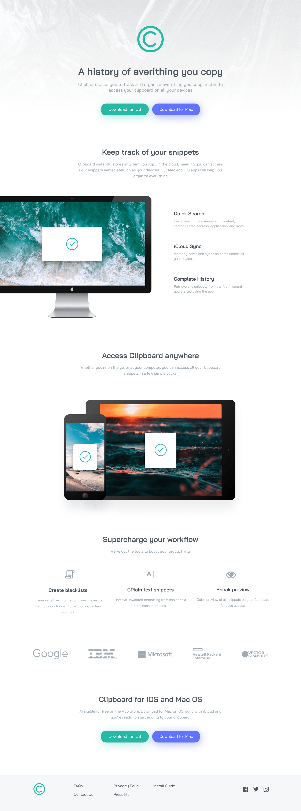

# Frontend Mentor - Clipboard landing page solution

This is a solution to the [Clipboard landing page challenge on Frontend Mentor](https://www.frontendmentor.io/challenges/clipboard-landing-page-5cc9bccd6c4c91111378ecb9). Frontend Mentor challenges help you improve your coding skills by building realistic projects. 

## Table of contents

- [Overview](#overview)
  - [The challenge](#the-challenge)
  - [Screenshot](#screenshot)
  - [Links](#links)
- [My process](#my-process)
  - [Built with](#built-with)
- [Author](#author)

## Overview

### Screenshot

### Links

- Solution URL: [Repo](https://github.com/karinaestaba/clipboard-landing-page.git)
- Live Site URL: [Demo](https://karinaestaba.github.io/clipboard-landing-page)

## My process

### Built with

- Semantic HTML5 markup
- CSS custom properties
- Flexbox, CSS GRID
- Sass

## Author

- Website - [Karina Estaba]
- Frontend Mentor - [karinaestaba](https://www.frontendmentor.io/profile/karinaestaba)
